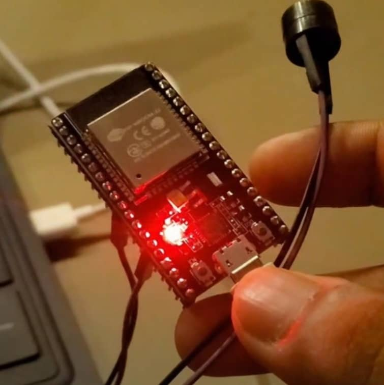
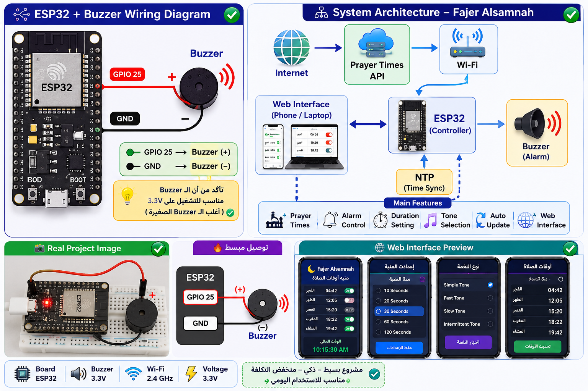
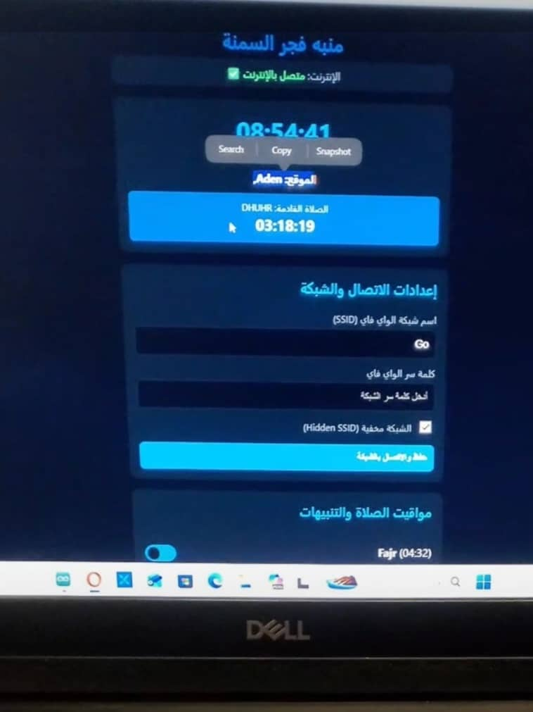

# 🌙 Fajer Alsamnah

## منبّه إسلامي ذكي لأوقات الصلاة باستخدام ESP32



## 📌 نبذة عن المشروع

**Fajer Alsamnah** هو مشروع **IoT** يعتمد على **ESP32 + Buzzer** لإنشاء منبّه ذكي لأوقات الصلاة، مع التركيز على مساعدة المستخدم على الاستيقاظ لصلاة **الفجر**.

يحصل النظام تلقائيًا على أوقات الصلوات من **Prayer Times API** عبر الإنترنت، ثم يقوم ESP32 بمراقبة الوقت وتشغيل المنبّه عند حلول الصلاة المحددة.

كما يوفر **Lightweight Web Interface** يمكن الوصول إليها من الهاتف للتحكم في إعدادات المنبّه.

## 🎯 المشكلة

أوقات الصلاة تتغير من يوم لآخر، مما يجعل ضبط المنبّه يدويًا أمرًا مزعجًا وقد يؤدي إلى نسيان تحديثه.

## 💡 الحل

يقوم النظام تلقائيًا بـ:

```text
Prayer Times API
        ↓
      ESP32
        ↓
Prayer Schedule
        ↓
Alarm Controller
        ↓
     Buzzer
```

وبذلك يتم تحديث أوقات الصلاة وتشغيل المنبّه تلقائيًا.

## ⭐ المميزات

- 🕌 دعم الصلوات الخمس
- ⏰ منبّه تلقائي لصلاة الفجر وبقية الصلوات
- 🌐 الحصول على أوقات الصلاة عبر الإنترنت
- 📱 Web Interface للتحكم من الهاتف
- 🔔 تشغيل/إيقاف المنبّه لكل صلاة
- ⏱️ تحديد مدة المنبّه
- 🎵 اختيار نوع النغمة
- 📍 دعم تحديد الموقع باستخدام Latitude و Longitude
- 🕐 مزامنة الوقت باستخدام NTP

## 📱 Web Interface

يمكن الوصول إلى واجهة التحكم من الهاتف المتصل بنفس شبكة Wi-Fi.

```text
http://ESP32-IP
```

مثال:

```text
http://192.168.1.100
```

## 🔌 Hardware

المكونات الأساسية:

```text
ESP32
Buzzer
USB Cable
Wi-Fi Network
```

### توصيل Buzzer

| Buzzer | ESP32 |
|---|---|
| (+) | GPIO 25 |
| (-) | GND |



## 📍 الموقع الافتراضي

```text
City: Aden
Country: Yemen

Latitude: 12.785496
Longitude: 45.018654
```

يمكن تغيير الإحداثيات لاستخدام المشروع في مدينة أخرى.

## 🔄 طريقة العمل

```text
1. تشغيل ESP32
2. الاتصال بـ Wi-Fi
3. مزامنة الوقت عبر NTP
4. الحصول على أوقات الصلاة من API
5. تشغيل Web Interface
6. المستخدم يحدد إعدادات المنبّه
7. ESP32 يراقب الوقت
8. عند حلول وقت الصلاة → تشغيل Buzzer
```

## 💻 المتطلبات

### Software

- Arduino IDE
- ESP32 Board Package
- ArduinoJson Library

### Hardware

- ESP32
- Buzzer
- USB Cable
- Wi-Fi

## ⚙️ طريقة التشغيل

1. افتح المشروع في **Arduino IDE**.
2. ثبّت دعم **ESP32**.
3. ثبّت مكتبة **ArduinoJson**.
4. أدخل بيانات Wi-Fi في الكود:

```cpp
const char* WIFI_SSID = "YOUR_WIFI_NAME";
const char* WIFI_PASSWORD = "YOUR_WIFI_PASSWORD";
```

5. اختر لوحة:

```text
ESP32 Dev Module
```

6. اختر منفذ **COM** الخاص بالـ ESP32.
7. اضغط **Upload**.
8. افتح **Serial Monitor** بسرعة:

```text
115200 Baud
```

9. انسخ عنوان الـIP وافتحه من الهاتف.

> ⚠️ يجب أن يكون الهاتف وESP32 على نفس شبكة Wi-Fi.

## 🖼️ صور المشروع

### Hardware



### Web Interface


## 🛠️ التقنيات المستخدمة

- ESP32
- Arduino / C++
- Wi-Fi
- REST API
- JSON
- NTP
- Web Server
- HTML / CSS / JavaScript
- Buzzer

## 🎓 الهدف من المشروع

المشروع يهدف إلى تطبيق مفاهيم **IoT و Embedded Systems** في مشروع عملي منخفض التكلفة يساعد المستخدم على متابعة أوقات الصلاة والاستيقاظ لصلاة الفجر.

## 🚀 تطوير مستقبلي

- OLED Display
- RTC Module
- Battery Backup
- دعم عدة مدن
- Offline Prayer Times
- Mobile Application
- Speaker بدلاً من Buzzer
- Automatic Location Detection

## ⚠️ ملاحظة

يحتاج النظام إلى اتصال بالإنترنت للحصول على أوقات الصلاة وتحديثها.

## 👨‍💻 المطور

**Abdullah Cyber**

Cybersecurity Student & Developer

---

### 🌙 Fajer Alsamnah

> **صلِّ في وقتك، واستيقظ للفجر بسهولة.**
